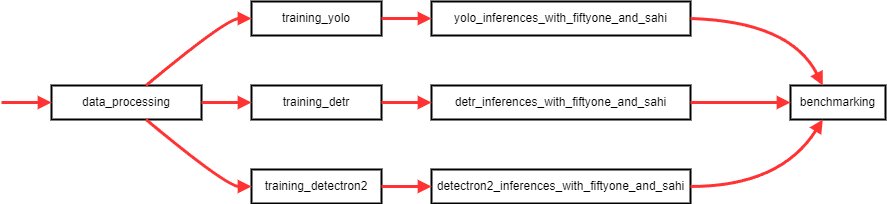

# Symbol Detection on Historical Maps - Notebooks
This folder contains Jupyter notebooks to train/finetune models for symbol detection on old maps, primarily focusing on Cassini maps. Here, you will find all the processes to prepare and augment your data, as well as train, evaluate, and test your models.
## Table of Contents
- [Notebooks Structure](#notebooks-structure)
- [Installation](#installation)
- [Pipeline Overview](#pipeline-overview)
  - [Data Processing](#data-processing)
  - [Training Models](#training-models)
  - [Inferences](#inference)
  - [Benchmarking](#benchmarking)
## Notebooks Structure
The folder is organized as follows:
```plaintext
├── notebooks/                      # Folder to run notebooks
│   ├── utils/                      # Utilities functions for the notebooks
│   ├── benchmarking.ipynb
│   ├── data_processing.ipynb
│   ├── detectron2_inferences_with_fiftyone_and_sahi.ipynb
│   ├── detr_inferences_with_fiftyone_and_sahi.ipynb
│   ├── Pipeline.md
│   ├── tests.ipynb
│   ├── training_detectron2.ipynb
│   ├── training_detr.ipynb
│   ├── training_yolo.ipynb
│   └── yolo_inferences_with_fiftyone_and_sahi.ipynb
```

## Pipeline Overview
The following pipeline outlines the steps for training and evaluating models for symbol detection on historical maps:
<div style="text-align: center;">
    
</div>

1. **Data Processing:**
   - Open and run [`data_processing.ipynb`](data_processing.ipynb) in Jupyter Notebook.
2. **Training Models:**
   - **YOLO:**
     - Open and run [`training_yolo.ipynb`](training_yolo.ipynb).
   - **DETR:**
     - Open and run [`training_detr.ipynb`](training_detr.ipynb).
   - **Detectron2:**
     - Open and run [`training_detectron2.ipynb`](training_detectron2.ipynb).
3. **Inferences:**
   - **YOLO:**
     - Open and run [`yolo_inferences_with_fiftyone_and_sahi.ipynb`](yolo_inferences_with_fiftyone_and_sahi.ipynb).
   - **DETR:**
     - Open and run [`detr_inferences_with_fiftyone_and_sahi.ipynb`](detr_inferences_with_fiftyone_and_sahi.ipynb).
   - **Detectron2:**
     - Open and run [`detectron2_inferences_with_fiftyone_and_sahi.ipynb`](detectron2_inferences_with_fiftyone_and_sahi.ipynb).
4. **Benchmarking:**
   - Open and run [`benchmarking.ipynb`](benchmarking.ipynb) in Jupyter Notebook.